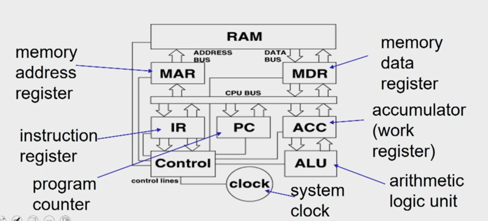
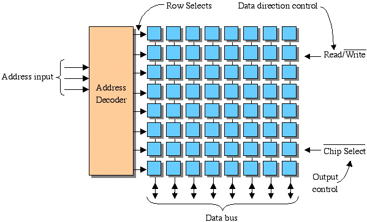
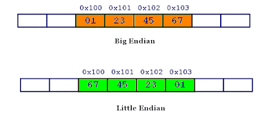

## Abstraction of Modern Computer Architecture
- Application
- Algorithm
- Programming Language
- Operating System/Virtual Machines
- **Instruction Set Architecture**
- **Microarchitectwre**
- **Register-Transfer Level**
- Gates
- Circuits
- Devices
- Physics

* ISA vs Microarchitecture

* ISA Characteristics
- Machine Models
- Encoding
- Data Types
- Instructions
- Addressing Modes

For each operation that is to be carried out with respect to an instruction, we
have multiple sub operations like instruction fetch, decode, operand fetch,
result store and next instruction.

## Instruction Execution Cycle
- Instruction Fetch - Obtain instruction from program storage
- Instruction Decode - Determine required actions and instruction size
- Operand Fetch - Locate and obtain operand data
- Execute - Compute result value or status
- Result Store - Deposit results in storage for later use
- Next Instruction - Determine successor instruction

## Processor Memory Interaction

If the processor wants to fetch an instruction, the first thing that you have
to do is the address of the instruction which is available in the program
counter has to be transferred to a MAR. Similarly, if processor wanted to read
or write any data into memory, then also the address has to be kept inside MAR.
So MAR is a register which is known as memory address register, which contains
the address of the next word that has to be accessed in the memory.

It can be either for a read or a fetch operation or it can be for a right
operation. Now whatever is the address that is placed in MAR, the data contents
are being exchanged through MDR. So, if it is a write operation, then the
contents in MDR are transferred to memory on a location specified by MAR. If it
is for an instruction fetch or a read operation, then the contents of the
designated location specified by MAR are being transferred to the processor and
it reaches MDR first.

 

## Instruction FETCH
1. address of the next instruction is transferred from PC to MAR
2. the instruction is located in memory
3. instruction is copied from memory to MDR
4. instruction is transferred to and decoded in the IR
5. control unit sends signals to appropriate devices to cause execution of the instruction

## Memory Address Decoder

## Byte Ordering
- Little Endian
- Big Endian
 

## Byte Alignment
### Data alignment 
Data alignment means putting the data in memory at address equal to some
multiple of the word size. This increases the performance of system due to the
way the CPU handles memory. 

### Data Structure Padding Now, to align the data, it may be necessary to
insert some extra bytes between the end of the last data structure and the
start of the next data structure as the data is placed in memory as multiples
of fixed word size. This insertion of extra bytes of memory to align the data
is called data structure padding.

## Types of operations

### Arithmetic and Logical Operations
- integer arithmetic
- comparing two quantities
- shifting, rotating bits in a quantity
- testing, comparing, and converting bits

### Data Movement Operations
- moving data from memory to the CPU
- moving data from memory to memory
- input and output

### Program Control Operations
- starting a program
- halting a program
- skipping to other instructions
- testing data to decide whether to skip over some instructions

## Instruction Set Architecture Multiple instructions combined together to form
program and multiple programs combined together to form software which will
basically is a big task. 

Opcode specifies what needs to be done operand specifies where it needs to be
done. And the set of all possible instruction that a processor can do it is
known as instruction set architecture.

## Classification of ISA

### Stack
- Accumulator
- Register-memory
- Register-register / load-store

### Addressing Modes

- Register            add r1, r2          r1 <- rl+r2
- Immediate           add r1, #5          r1 <- r1+5
- Direct              add r1, (0x200)     r1 <- r1+M[0x200]
- Register indirect   add r1, (r2)        r1 <- r1+M[r2]
- Displacement        add r1, 100(r2)     r1 <- r1+M[r2+100]
- Indexed             add r1, (r2+r3)     r1 <- r1+M[r2+r3])
- Scaled              add r1, (r2+r3*4)   r1 <- r1+M[(r2+r3*4]
- Memory indirect     add r1, @(r2)       r1 <- r1+M[M[r2]]
- Auto-increment      add r1, (r2)+       r1 <- r1+M[r2], r2++
- Auto-decrement      add r1, -(r2)       r2--, r1 <- r1+M[r2]

## Architecture vs. Microarchitecture

### “Architecture”/Instruction Set Architecture:
- Programmer visible state (Memory & Register)
- Operations (Instructions and how they work)
- Execution Semantics (interrupts)
- Input/Output
- Data Types/Sizes

### Microarchitecture/Organization:
- Tradeoffs on how to implement ISA for some metric (Speed, Energy, Cost)
- Examples: Pipeline depth, number of pipelines, cache size, silicon area, peak
  power, execution ordering, bus widths, ALU widths

## Why the Diversity in ISAs? Technology Influenced ISA
- Storage is expensive, tight encoding important
- Reduced Instruction Set Computer
  - Remove instructions until whole computer fits on die
- Multicore/Manycore
  - Transistors not turning into sequential performance

Application Influenced ISA
- Instructions for Applications
  - DSP instructions
- Compiler Technology has improved
  - SPARC Register Windows no longer needed
  - Compiler can register allocate effectively

