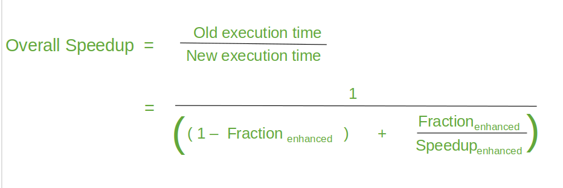

## When can we say one computer / architecture / design is better than others?
- Desktop PC (execution time of a program)
- Server (transactions / unit time)

## When can we say X is n times fasterthanY ?
- Execution time(y) / Execution time(x) =n
- Throughput(x) / Throughput(y) = n

## Typical performance metrics
- Response time - When a request is coming from a machine to another machine,
  the time for the second machine to respond to that request is known as
  response time
- Throughput - Number of task that is completed in a unit time
- CPU time - Total time associated with respect to a program in cpu execution
- Wall clock time - Actual time taken for a program to execute ie sum total of
  cpu time and non-cpu time(peripheral time)
- Speedup - If the execution time of one is larger than other then it means
  speedup

## Benchmarks

- Toy programs (e.g. sorting, matrix multiply)
- Synthetic benchmarks (e.g. Dhrystone)
- Benchmark suites (e.g. SPEC06, SPLASH)

## SPECRatio
SPECRatio(A) = Execution time(reference) / Execution time(A)

Reference for SPEC 2006:
Sun Ultra Enterprise 2 workstation with a 296-MHz UltraSPARC II processor

## Amdhal's Law 
- Amdahl’s Law defines the speedup that can be gained by improving some portion
  of a computer.
- The performance improvement to be gained from using some faster mode of
  execution is limited by the fraction of the time the faster mode can be used.

### Example
Suppose that we want to enhance the floating point operations of a processor by
introducing a new advanced FPU unit. Let the new FPU is 10 times faster on
floating point computations than the original processor. Assuming a program has
40% floating point operations, what is the overall speedup gained by
incorporating the enhancement?

Solution:
- Fraction enhanced = 0.4
- Speedup enhanced = 10
- Therefore speedup = 1/(0.6 + 0.4/10) = 1.56 times faster

## Example
A common transformation required in graphics processors is square root.
Implementations of floating-point (FP) square root vary significantly in
performance, especially among processors designed for graphics. Suppose FP
square root (FPSQR) is responsible for 20% of the execution time of a critical
graphics benchmark.

One proposal is to enhance the FPSQR hardware and speed up this operation by a
factor of 10. The other alternative is just to try to make all FP instructions
in the graphics processor run faster by a factor of 1.6; FP instructions are
responsible for half of the execution time for the application. Compare these
two design alternatives using Amdahl's Law.

Solution:
- Case A: FPSQR hardware optimization 
  - S = 1.219
- Case B: FP instructions optimization
  - S = 1.23

## Principles of Computer Design

- All processors are driven by clock.
- Expressed as clock rate in GHz or clock period in ns
- CPU Time = CPU clock cycles x clock cycle time

CPl = CPU clock cycles for a program / Instruction Count
CPU Time = IC * CPI * CCT

- Clock cycle time- hardware technology
- CPI- Organization and ISA
- IC-ISA and compiler technology

### Example: Basic Performance Analysis
Consider two programs A and B that solves a given problem. A is scheduled to
run on a processor P1 operating at 1 GHz and B is scheduled to run on processor
P2 running at 1.4 GHz. A has total 10000 instructions, out of which 20% are
branch instructions, 40% load store instructions and rest are ALU instructions.
B is composed of 25% branch instructions. The number of load store instructions
in B is twice the count of ALU instructions. Total instruction count of B is
12000. In both P1 and P2 branch instructions have an average CPI of 5 and ALU
instructions has an average CPI of 1.5. Both the architectures differ in the
CPI of load-store instruction. They are 2 and 3 for P1 and P2, respectively.
Which mapping (A on P1 or B on P2) solves the problem faster, and by how much?

 

### Amdahl's Law
A company is releasing 2 latest versions (beta and gamma) of its basic
processor architecture named alpha. Beta and gamma are designed by
making modifications on three major components (X, Y and Z) of the alpha.
It was observed that for a program A the fractions of the total execution time
on these three components, X, Y, and Z are 40%, 30%, and 20%,
respectively. Beta speeds up X and Z by 2 times but slows down Y by 1.3
times, where as gamma speeds up X, Y and Z by 1.2, 1.3 and 1.4 times,
respectively.
a. How much faster is gamma over alpha for running A?
b. Whether beta or gamma is faster for running A? Find the speedup factor

Solution:
a. Gamma is 1.239 times faster over alpha
b. Beta is faster than gamma -> 1.267/1.239 = 1.022 times

