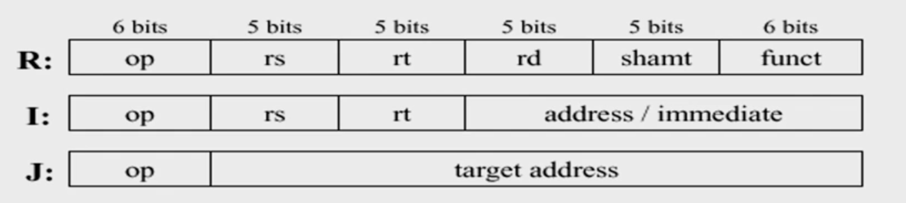
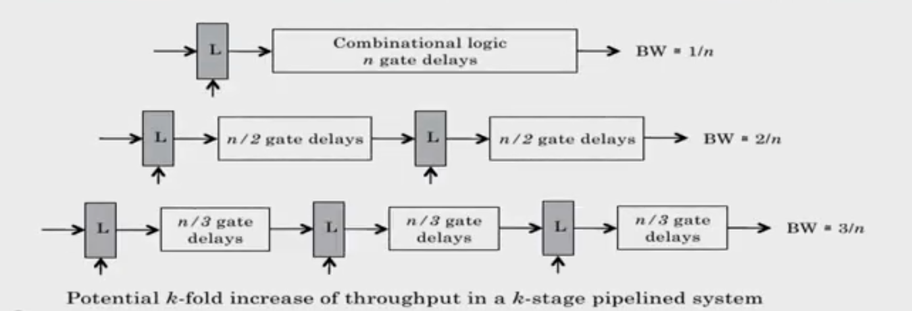
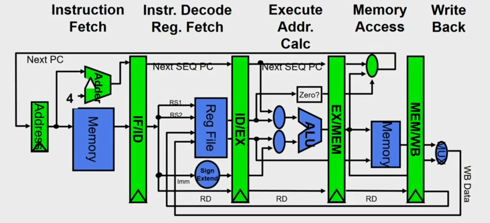

# Introduction to MIPS
- Microprocessor without Interlocked Pipelined Stages
- 32 registers (32 bit each)
- Uniform length instructions
- RISC- Load store architecture

## Advantages of MIPS
- It is easy to understand and measure
- It helps in calculation of CPU processor speed (cycles per second), CPI
  (average clock cycles per instruction) and Execution time.
- It handles when amount of work is large.

## Disadvantages of MIPS
- It may not reflect real execution, since simple instructions do way better.
- It is an older, obsolete measure of a computer’s speed and power

## Instruction Representation

- op: basic operation of the instruction (opcode)
- rs: first source operand register
- rt: second source operand register
- rd: destination operand register
- shamt: shift amount
- funct: selects the specific variant of the opcode (function code)
- address: offset for load/store instructions (+/-2^15)
- immediate: constants for immediate instructions

R = Register type instruction

## Pipeline Characteristics
- Pipelining doesn't reduce latency of single task, it improves throughput of
  entire workload
- Pipeline rate limited by slowest pipeline stage
- Potential speedup = Number of pipe stages
- Unbalanced lengths of pipe stages reduces speedup
- Time to fill pipeline and time to drain it reduces speedup

## Pipeline in Circuits
- Pipelining partitions the system into multiple independent stages with added
  buffers between the stages.
- Pipelining can increase the throughout of a system.

Dividing the actual circuit which was n-logic gates into smaller sub components
and to interface with them with latches is called pipelining inside the
circuits

## Pipeline in MIPS

- Each instruction can take at most 5 clock cycles

1. Instruction fetch cycle (IF)
  - Based on PC, fetch the instruction from memory
  - Increment PC

2. Instruction decode/register fetch cycle (ID)
  - Decode the instruction + register read operation
  - Fixed field decoding
  - Ex: [ADD R1,R2,R3] : A3.01.02.03
    - 10100011 00000001 00000010 00000011
  - Ex: [LW R1,8(R2)] : 86.01.02.03
    - 10000110 00000001 00001000 00000010
  - Equality check of registers
  - Computation of branch target address if any

3. Execution/Effective address cycle (EX)
  - Memory reference: Calculate the effective address
    - [LW R1,8(R2)]       Effective ADDR= [R2] +8
  - Register-register ALU instruction
    - [ADD R1,R2,R2]      Actual execution ie R2+R3
  - Register-immediate ALU instruction

4. Memory access cycle (MEM)
  - Load instruction: Read from memory using effective address [LW R1,8(R2)]
  - Store instruction: Write the data in the register to memory using effective
    address [SW R3,16(R4)]

5. Write-back cycle (WB)
  - Register-register ALU instruction or load instruction
  - Write the result to register file [LW R1,8(R2)], [ADD R1,R2,R3]

- Cycles required to implement different instructions
  - Branch instructions — 4 cycles
  - Store instructions — 4 cycles
  - All other instructions — 5 cycles

## Pipeline Issues

- Ideal Case: Uniform sub-computations
  - The computation to be performed can be evenly partitioned into uniform-latency sub-computations
- Reality: Internal fragmentation
  - Not all pipeline stages may have the uniform latencies
- Impact of ISA
  - Memory access is a critical sub-computation
  - Memory addressing modes should be minimized
  - Fast cache memories should be employed

- Ideal Case : Identical computations
  - The same computation is to be performed repeatedly on a large number of input data sets
- Reality: External fragmentation
  - Some pipeline stages may not be used
- Impact of ISA
  - Reduce the complexity and diversity of the instruction types
  - RISC architectures use uniform stage simple instructions

- Ideal Case : Independent computations
  - All the instructions are mutually independent
- Reality: Pipeline stalls - cannot proceed
  - A later computation may require the result of an earlier computation
- Impact of ISA
  - Reduce Memory addressing modes - dependency detection
  - Use register addressing mode - easy dependencies check

