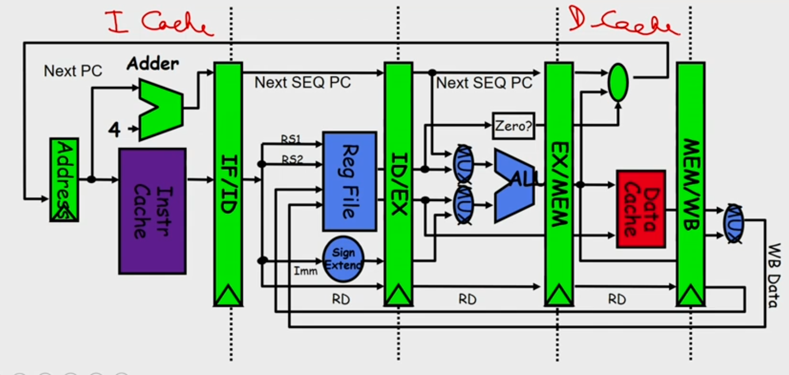

## Pipeline Hazards

- Hazards: circumstances that would cause incorrect execution if next
  instruction is fetched and executed
- **Structural hazards:** Different instructions, at different stages, in the
  pipeline want to use the same hardware resource
- **Data hazards:** An instruction in the pipeline requires data to be computed by
  a previous instruction still in the pipeline
- **Control hazards:** Succeeding instruction, to put into pipeline, depends on the
  outcome of a previous branch instruction, already in pipeline

## Structural Hazard
- Eliminate the use same hardware for two different things at the same time
- Solution 1: Wait
  - must detect the hazard
  - must have mechanism to stall

- Solution 2: Duplicate hardware
  - Multiple such units will help both instruction to progress
 

## Data Hazard
- 
