# Pipeline Hazards

- Hazards: circumstances that would cause incorrect execution if next
  instruction is fetched and executed
- **Structural hazards:** Different instructions, at different stages, in the
  pipeline want to use the same hardware resource
- **Data hazards:** An instruction in the pipeline requires data to be computed by
  a previous instruction still in the pipeline
- **Control hazards:** Succeeding instruction, to put into pipeline, depends on the
  outcome of a previous branch instruction, already in pipeline

## Structural Hazard
- Eliminate the use same hardware for two different things at the same time
- Solution 1: Wait
  - must detect the hazard
  - must have mechanism to stall

- Solution 2: Duplicate hardware
  - Multiple such units will help both instruction to progress
 

## Data Hazard

### Read After Write(RAW)
- Instr-2 tries to read operand before Instr-1, writes it
  ```
  Instr-1: add r1,r2,r3
  Instr-2: sub r4,r1,r3
  ```

### Write After Read (WAR)
- Instr-2, writes operand before Instr-1, reads it
  ```
  Instr-1: sub r4,r1,r3
  Instr-2: add r1,r2,r3
  Instr-3: mul r6,r1,r7
  ```
- Called an anti-dependence by compiler writers.
- This results from reuse of the name r1
- Can’t happen in MIPS 5 stage pipeline because:
  - All instructions take 5 stages, and
  - Reads are always in stage 2, and
  - Writes are always in stage 5

### Write After Write (WAW)
- Instr-2, writes operand before Instr-1, writes it.
  ```
  Instr-1: sub r1,r4,r3
  Instr-2: add r1,r2,r3
  Instr-3: mul r6,r1,r7
  ```
- Called an output dependence
- This also results from the reuse of name r1
- Can’t happen in MIPS 5 stage pipeline because:
  - All instructions take 5 stages, and
  - Writes are always in stage 5
- WAR and WAW happens in out of order pipes

### Handle Data hazards
- Data hazard: instruction needs data from the result of a previous
instruction still executing in pipeline
- Solution: Forward data if possible

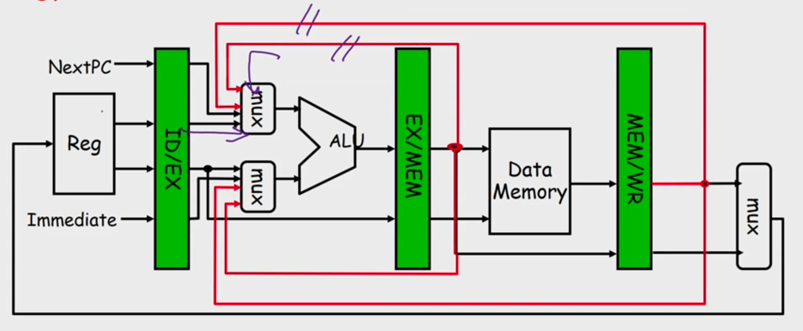 

- Load ALU Hazard
- Solution: Delay the next instruction (add bubble)
- Software Solution: Arrange the instructions while compiling to avoid hazard

## Control Hazard
- Normal MIPS Pipeline
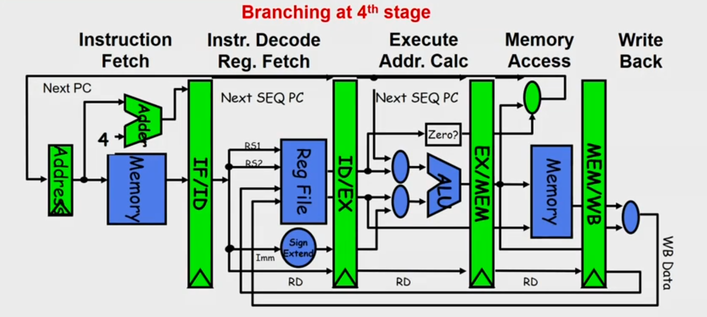 
- Modern MIPS Pipeline
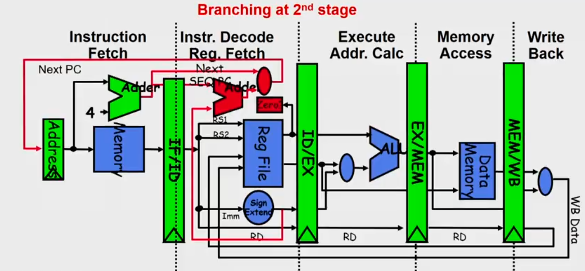 

### Four Branch Hazard Alternatives 

#### 1: Stall until branch direction is clear 

#### 2: Predict Branch Not Taken
- Execute successor instructions in sequence
- "Squash" instructions in pipeline if branch actually taken

#### 3: Predict Branch Taken
- But branch target address in is not known by IF stage
- Target is known at same time as branch outcome (IDstage)
- MIPS still incurs 1 cycle branch penalty

#### 4: Delayed Branch
- Define branch to take place AFTER one instruction following the branch
  instruction
- 1 slot delay allows proper decision and branch target address in 5 stage
  pipeline (MIPS uses this approach)
- Where to get instructions to fill branch delay slot?
   

## Conditional Branches
- When do you know you have a branch?
  - During ID cycle (Could you know before that?)
- When do you know if the branch is Taken or Not-Taken
  - During EXE cycle/ ID stage depending on the design
- We need for sophisticated solutions for following cases
  - Modern pipelines are deep ( 10 + stages)
  - Several instructions issued/cycle
  - Several predicted branches in-flight at the same time

## Dynamic branch prediction
- Execution of a branch requires knowledge of:
- Branch instruction - encode whether instruction is a branch or not. Decide on
  taken or not taken (i.e., prediction can be done at IF stage)
- Whether the branch is Taken/Not-Taken (hence a branch prediction mechanism)
- If the branch is taken what is the target address (can be computed but can
  also be "precomputed", i.e., stored in some table)
- If the branch is taken what is the instruction at the branch target address
  (saves the fetch cycle for that instruction)

- Use a **Branch Prediction Buffer(BPB)**
  - Also called Branch Prediction Table (BPT), Branch History Table (BHT)
  - Records previous outcomes of the branch instruction
  - How to index into the table is an issue
- A prediction using BPB is attempted when the branch instruction is fetched
  (IF stage or equivalent)
- It is acted upon during ID stage (when we know we have a branch)

- Has a prediction been made (Y/N)
  - If not use default "Not Taken"
- Is it correct or incorrect ?
- Two cases:
  - Case 1: Yes and the prediction was correct (known at ID stage) or No but
    the default was correct: No delay
  - Case 2: Yes and the prediction was incorrect or No and the default was
    incorrect: Delay

### Prediction Scheme with 1 or 2 bit FSM
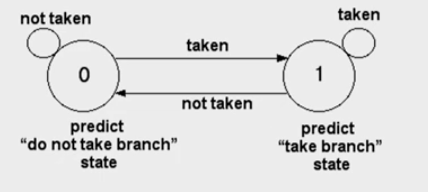
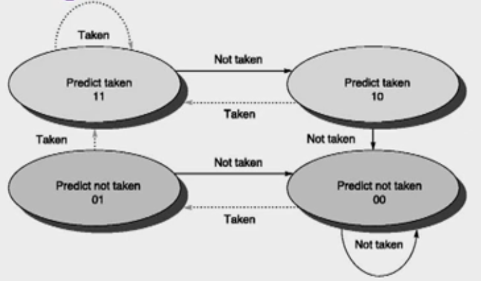 
- The use of a 2-bit predictor will allow branches that favor taken (or not
  taken) to be mispredicted less often than the one-bit case. (reinforcement
  learning)

### Branch Prediction In Hardware
- Branch prediction is extremely useful in loops.
- A simple branch prediction can be implemented using a small amount of memory
  indexed by lower order bits of the address of the branch instruction. (branch
  prediction buffer)
- One bit stores whether the branch was taken or not
- The next time the branch instruction is fetched refer this bit

### Advanced Branch Prediction Techniques
#### Basic 2-bit predictor:
- For each branch:- Predict T or NT
- If the prediction is wrong for two consecutive times, change prediction

#### Correlating predictor:
- Multiple 2-bit predictors for each branch
- One for each possible combination of outcomes of preceding n branches
```
if(x==2)  /*br-1*/
x=0;
if(y==2)  /*br-2*/
y=0;
if(x!=y)  /*br-3*/
    do this
else do that
```

#### Local predictor
- Multiple 2-bit predictors for each branch
- One for each possible combination of outcomes for the last n occurrences of this branch

#### Tournament predictor
- Combine correlating predictor with local predictor

## Branch-Target Buffer
- To reduce the branch penalty, know whether the as-yet-un-decoded instruction is a branch. If so, what the next program counter (PC) should be
- If the instruction is a branch and we know what the next PC should be, we can have a branch penalty of zero
- A branch-prediction cache that stores the predicted address for the next instruction after a branch is called a branch-target buffer (BTB) or branch-target cache.
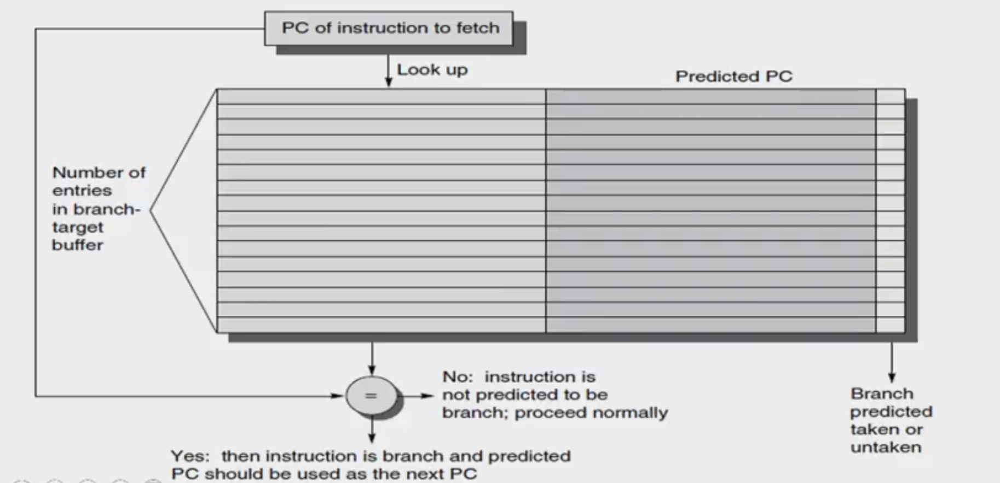 
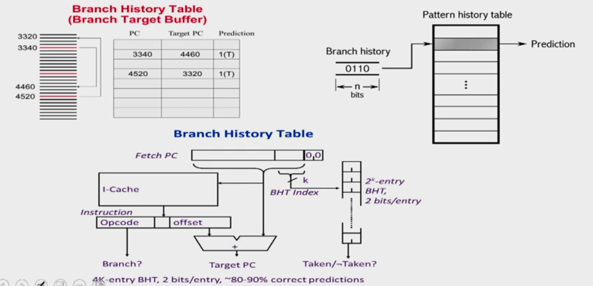 

## Branch Folding
- Optimization on BTB to make zero cycle branch 
  - Larger branch-target buffer- store one or more target instructions
  - Add target instruction into BTB to deal with longer decoding time required by larger buffer
  - Branch folding can be used to obtain 0-cycle unconditional branches and sometimes 0-cycle conditional branches


# Questions

## Example 1 
Given a non-pipelined architecture running at 1.5 GHz, that takes 5 cycles to
finish an instruction. You want to make it pipelined with 5 stages. Due to
hardware overhead the pipelined design will operate only at 1 GHz. 5% of memory
instructions cause a stall of 50 cycles, 30% of branch instruction cause a
stall of 2 cycles and load-ALU combinations cause a stall of 1 cycle. Assume
that in a given program, there exist 20% of branch instructions and 30% of
memory instructions. 10% of instructions are load-ALU combinations. What is the
speedup of pipelined design over the non-pipelined design?

Ans:
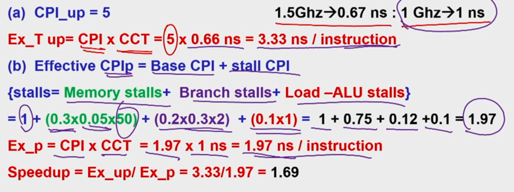 

## Example 2 
A program has 2000 instructions in the sequence L.D, ADD.D, L.D, ADD.D,.....
L.D, ADD.D. The ADD.D instruction depends on the L.D instruction right before
it. The L.D instruction depends on the ADD.D instruction right before it. If
the program is executed on the 5-stage pipeline what would be the actual CPI
with and without operand forwarding technique?

Ans:
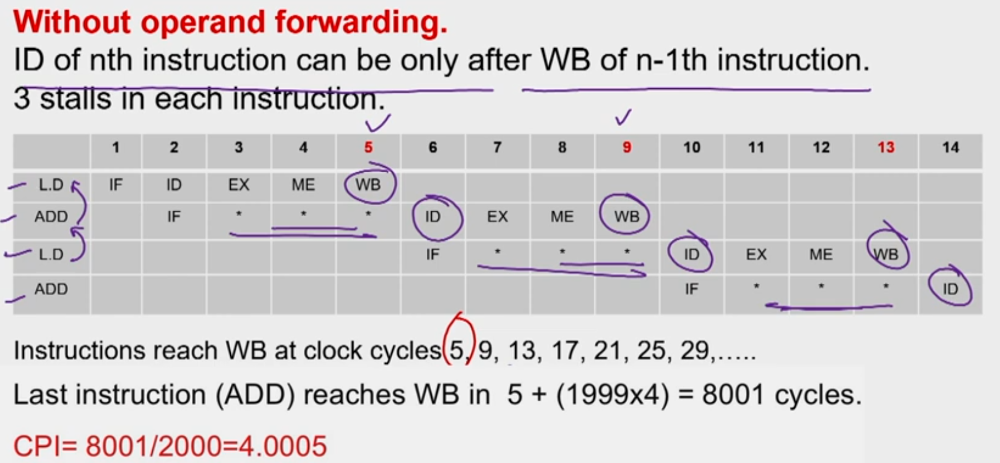 
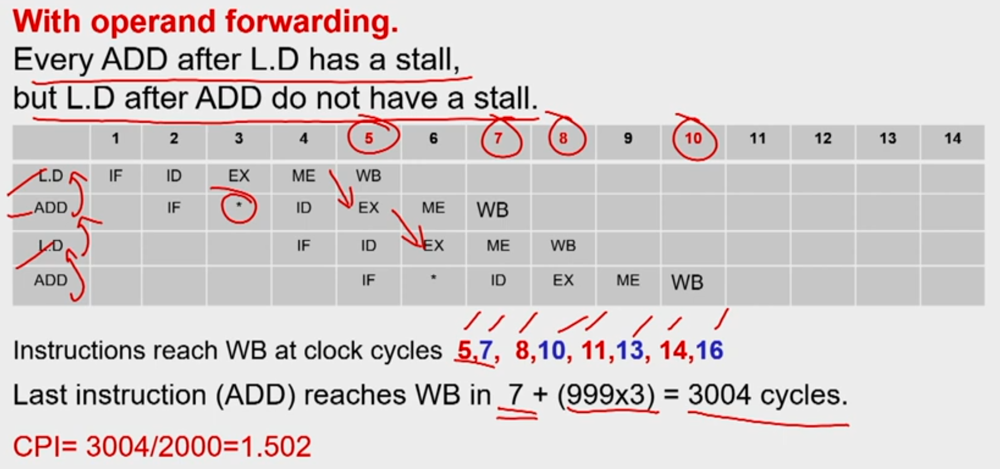 

## Example 3: Branch Prediction
Consider the last 16 actual outcomes of a single static branch. T means branch
is taken and N means not taken.

{oldest> TTNNTNTTTNTNTTNT < latest}

A two level branch predictor of (1,2) type is used. Since there is only one
branch in the program indexing to BHT with PC is irrelevant. Hence only last
branch outcome only is used to index to the BHT. How many mis-predictions are
there and which of the branches in this sequence would be mis-predicted? Fill
up the table for 16 branch outcomes.

Ans:
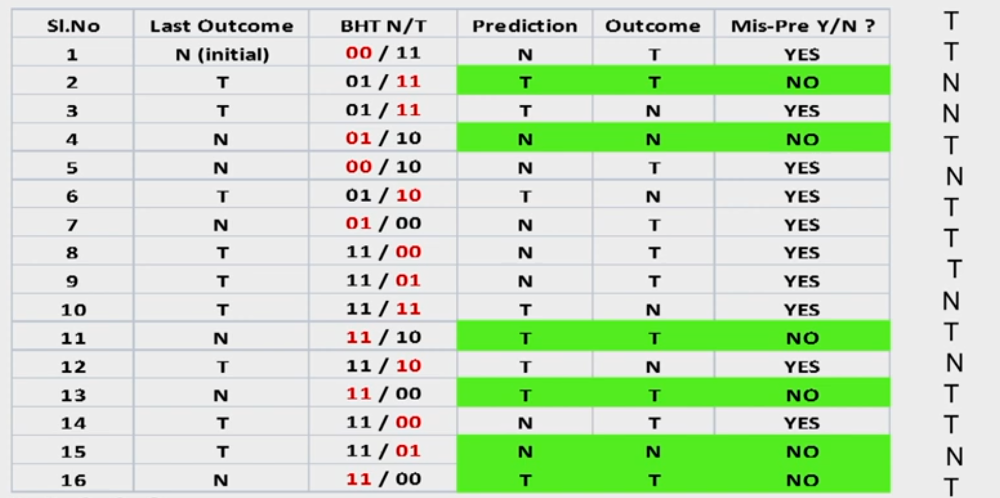 

