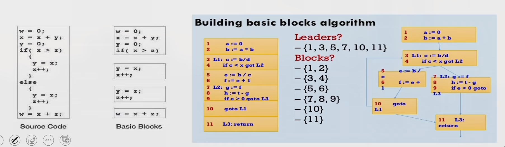
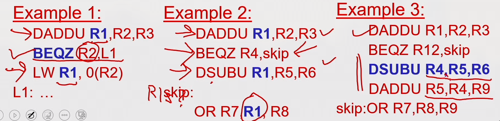
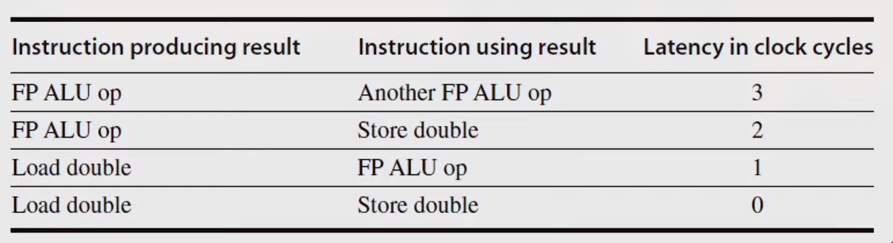
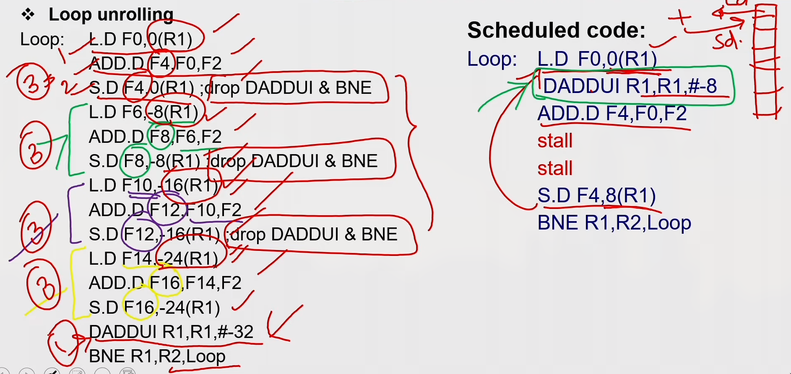
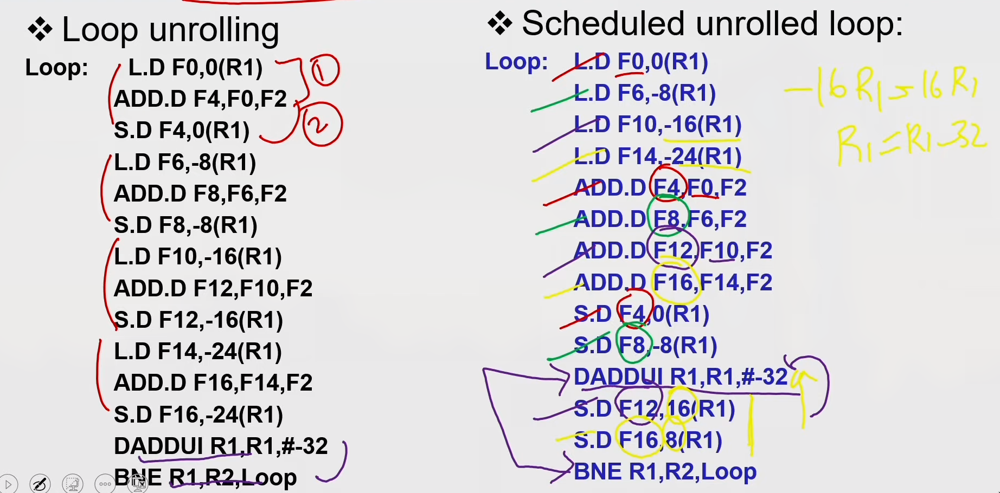

## Introduction
- Pipelining overlaps execution of instructions
Exploits Instruction Level Parallelism (ILP)

- There are two main approaches:
  - Compiler-based static approaches
  - Hardware-based dynamic approaches
- Exploiting ILP is to minimize CPI
  - Pipeline CPI = Ideal (base) CPI + Structural stalls + Data hazard stalls +
    Control stalls

## Parallelism limitation within Basic Block
- The basic block- a straight-line code sequence without branches in except to
  the entry and no branches out except at the exit.
- Parallelism with basic block is limited. Typical size of basic block few
  instructions only. Must optimize across multiple blocks (branches)



## Data Dependence
- Loop-Level Parallelism
  - Unroll loop statically or dynamically
- Challenges—> Data dependency
- Data dependence conveys possibility of a hazard
- Dependent instructions cannot be executed simultaneously
- Pipeline determines if dependence is detected and if it causes a stall or not
- Data dependence conveys upper bound on exploitable instruction level
  parallelism

## Name Dependence & Output dependence
- Two instructions use the same name but no flow of information.
- Not a true data dependence, but is a problem when reordering instructions
- **Antidependence:** instruction j writes a register or memory location that instruction i reads
  - Initial ordering (i before j) must be preserved
- **Output dependence:** instruction i and instruction j write the same register or memory location
  - Ordering must be preserved
- To solve, use register renaming techniques

## Control Dependence
- Ordering of instruction with respect to a branch instruction
  - Instruction that is control dependent on a branch cannot be moved **before**
    the branch so that its execution is no longer controller by the branch
  - An instruction that is not control dependent on a branch cannot be moved
    **after** the branch so that its execution is controlled by the branch.
    ```
    if p1 {S1;};
    if p2 {S2;};
    ```
- Instruction that is control dependent on a branch cannot be moved **before** the
  branch so that its execution is no longer controller by the branch
- An instruction that is not control dependent on a branch cannot be moved
  **after** the branch so that its execution is controlled by the branch.
 

## Compiler Techniques for Exposing ILP
- Find and overlap sequence of unrelated instruction 
- Pipeline scheduling
  - Separate dependent instruction from the source instruction by pipeline
    latency of the source instruction
  ```
  Example:
  for (i=999; i>=0; i=i-1)
    x[i] = X[i] +s;
  ```
  

MIPS Assembly code for above code:
```
loop:
  L.D F0,0(R1)
  stall
  ADD.D F4,F0,F2
  stall
  stall
  S.D F4,0(R1)
  DADDUI R1,R1,#-8
  stall (assume integer load latency is 1)
  BNE R1,R2,Loop
```
Scheduled Code:
```
loop:
  L.D FO,0(R1)
  DADDUI R1,R1,#-8
  ADD.D F4,F0,F2
  stall
  stall
  S.D F4,8(R1)
  BNE R1.R2.Loop
```

## Loop Unrolling


## Loop Unrolling / Pipeline Scheduling
 

## Strip Mining
- Unknown number of loop iterations?
  - Goal: make k copies of the loop body Number of iterations = n
  - Generate pair of loops:
    - First executes n mod k times
    - Second executes n / k times
    - Strip mining
  - Example: Let n=35, k=4
    - Loop 1 execute 3 times
    - Loop 2 execute 8 times by unrolling 4 copies per iteration
  
## Steps in Loop Unrolling and Scheduling
- Determine that unrolling the loop would be useful.
- Identify independency of loop iterations.
- Use different registers to avoid unnecessary constraints put in on same
  computations.
- Eliminate the extra test and branch instructions and adjust the loop
  termination and iteration code.
- Determine whether the loads and stores from different iterations are
  independent.
- Schedule the code, preserving any dependences needed to yield the same result
  as the original code.

## Loop Unrolling & Pipeline Scheduling
- Limitations of loop unrolling:
  - Code size limitations — I-cache miss
  - Compiler limitations — register pressure

