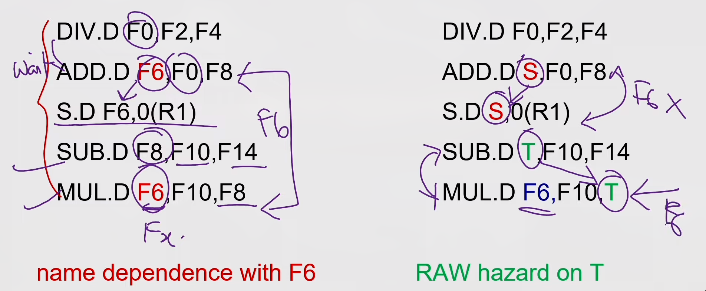
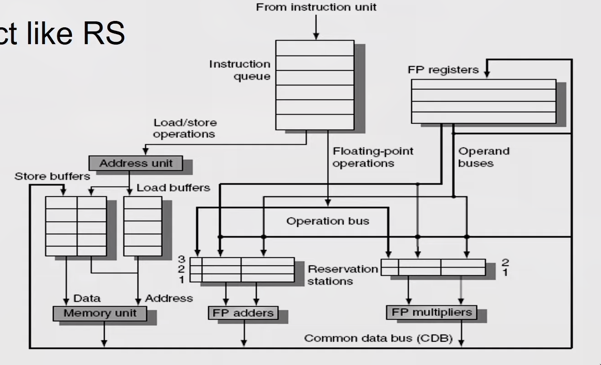
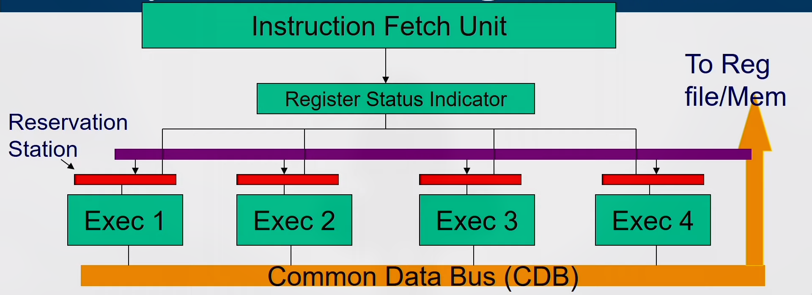

## Introduction
- Pipelining overlaps execution of instructions
Exploits Instruction Level Parallelism (ILP)

- There are two main approaches:
  - Compiler-based static approaches
  - Hardware-based dynamic approaches
- Exploiting ILP is to minimize CPI
  - Pipeline CPI = Ideal (base) CPI + Structural stalls + Data hazard stalls +
    Control stalls

## Parallelism limitation within Basic Block
- The basic block- a straight-line code sequence without branches in except to
  the entry and no branches out except at the exit.
- Parallelism with basic block is limited. Typical size of basic block few
  instructions only. Must optimize across multiple blocks (branches)


## Data Dependence
- Loop-Level Parallelism
  - Unroll loop statically or dynamically
- Challenges—> Data dependency
- Data dependence conveys possibility of a hazard
- Dependent instructions cannot be executed simultaneously
- Pipeline determines if dependence is detected and if it causes a stall or not
- Data dependence conveys upper bound on exploitable instruction level
  parallelism

## Name Dependence & Output dependence
- Two instructions use the same name but no flow of information.
- Not a true data dependence, but is a problem when reordering instructions
- **Antidependence:** instruction j writes a register or memory location that instruction i reads
  - Initial ordering (i before j) must be preserved
- **Output dependence:** instruction i and instruction j write the same register or memory location
  - Ordering must be preserved
- To solve, use register renaming techniques

## Control Dependence
- Ordering of instruction with respect to a branch instruction
  - Instruction that is control dependent on a branch cannot be moved **before**
    the branch so that its execution is no longer controller by the branch
  - An instruction that is not control dependent on a branch cannot be moved
    **after** the branch so that its execution is controlled by the branch.
    ```
    if p1 {S1;};
    if p2 {S2;};
    ```
- Instruction that is control dependent on a branch cannot be moved **before** the
  branch so that its execution is no longer controller by the branch
- An instruction that is not control dependent on a branch cannot be moved
  **after** the branch so that its execution is controlled by the branch.
 

## Compiler Techniques for Exposing ILP
- Find and overlap sequence of unrelated instruction 
- Pipeline scheduling
  - Separate dependent instruction from the source instruction by pipeline
    latency of the source instruction
  ```
  Example:
  for (i=999; i>=0; i=i-1)
    x[i] = X[i] +s;
  ```
  

MIPS Assembly code for above code:
```
loop:
  L.D F0,0(R1)
  stall
  ADD.D F4,F0,F2
  stall
  stall
  S.D F4,0(R1)
  DADDUI R1,R1,#-8
  stall (assume integer load latency is 1)
  BNE R1,R2,Loop
```
Scheduled Code:
```
loop:
  L.D FO,0(R1)
  DADDUI R1,R1,#-8
  ADD.D F4,F0,F2
  stall
  stall
  S.D F4,8(R1)
  BNE R1.R2.Loop
```

## Loop Unrolling


## Loop Unrolling / Pipeline Scheduling
 

## Strip Mining
- Unknown number of loop iterations?
  - Goal: make k copies of the loop body Number of iterations = n
  - Generate pair of loops:
    - First executes n mod k times
    - Second executes n / k times
    - Strip mining
  - Example: Let n=35, k=4
    - Loop 1 execute 3 times
    - Loop 2 execute 8 times by unrolling 4 copies per iteration
  
## Steps in Loop Unrolling and Scheduling
- Determine that unrolling the loop would be useful.
- Identify independency of loop iterations.
- Use different registers to avoid unnecessary constraints put in on same
  computations.
- Eliminate the extra test and branch instructions and adjust the loop
  termination and iteration code.
- Determine whether the loads and stores from different iterations are
  independent.
- Schedule the code, preserving any dependences needed to yield the same result
  as the original code.

## Loop Unrolling & Pipeline Scheduling
- Limitations of loop unrolling:
  - Code size limitations — I-cache miss
  - Compiler limitations — register pressure

# Dynamic Scheduling
- Rearrange execution order of instructions to reduce stalls while maintaining data flow.
- Advantages
  - Compiler doesn't need to have knowledge of micro-architecture
  - Handles cases where dependencies are unknown at compile time
  ```
  str R2, 8(R1)
  ld R3, 16(R4)
  // will access same location if 8+[R1] == 16+[R4]
  ```
- Disadvantages
  - Substantial increase in hardware complexity
  - Complicates exceptions

## How dynamic scheduling works?
- Limitation of simple pipelining.
  - In-order instruction issue and execution.
  - Instructions are issued in program order.
  - If an instruction is stalled in the pipeline, no later instructions can
  proceed.

  ```
  add rl,r2,r3
  sub r4,rl,xr3
  and r6,rl,r7
  or r8,rl,r9
  ```
- Limitation of simple pipelining.
  - In-order instruction issue and execution.
  - Instructions are issued in program order.
  - If an instruction is stalled in the pipeline, no later instructions can
    proceed.

- If instruction j depends on a long-running instruction i, currently in
  execution in the pipeline, then all instructions after j must be stalled
  until i is finished and j can execute.

  ```
  DIV.D FO,F2,F4
  ADD.D F10,FO,F8
  SUB.D F12.F8,F14
  ```
- Separate the issue process into two parts:
  - checking for any structural hazards.
  - waiting for the absence of a data hazard
- Use in-order instruction issue but we want an instruction to begin execution
  as soon as its data operands are available.
- out-of-order execution - out-of-order completion.
- OOO execution introduces the possibility of WAR and WAW hazards

```
DIV.D FO,F2,F4      // can have divide by zero exception
ADD.D F6,FO0,F8
SUB.D F8,F10,F14    // already completed before div instruction
MUL.D F6,F10,F8
```

- WAR and WAW hazards — solved by register renaming
- Possibility of imprecise exception (2 possibilities).
  - The pipeline may have already completed instructions that are later in
    program order than the instruction causing the exception.
  - The pipeline may have not yet completed some instructions that are earlier
    in program order than the instruction causing the exception

- To allow out-of-order execution, split the ID stage into two
  - Issue-Decode instructions, check for structural hazards.
  - Read operands-Wait until no data hazards, then read operands.
- In a dynamically scheduled pipeline, all instructions pass through the issue
  stage in order (in-order issue); however, they can be stalled or bypass each
  other in the second stage (read operands) and thus enter execution out of
  order.
- Done by - score boarding technique
- Approach used - Tomasulo’s algorithm

## Register Renaming

 

- Register renaming is done by reservation stations (RS)
- Each RS Contains:
  - The instruction (operation to be done)
  - Buffered operand values (when available)
  - Reservation station number of instruction providing the operand values
- RS fetches and buffers an operand as soon as it becomes available (not
  necessarily involving register file)
- Pending instructions designate the RS that will provide input
- Result values broadcast on common data bus (CDB)

# Tomasulo's Algorithm
- Load and store buffers contain data and addresses.
- They also act as RS

 

### Issue 
- Get next instruction from FIFO queue
- If RS available, issue the instruction to the RS with operand values if
  available
- If operand values not available, stall the instruction

### Execute
- When operand becomes available, store it in any reservation stations waiting
  for it
- When all operands are ready, execute the instruction
- Loads and store uses buffers
- No instruction will initiate execution until all branches that precede it in
  program order have completed

### Write result
- Write result into CDB (there by it reaches the reservation station, store
  buffer and registers file) with name of execution unit that generated the
  result.
- Stores must wait until address and value are received


- Instructions are fetched one by one and decoded to find the type of operation
  and the source of operands
- Register Status Indicator indicates whether the latest value of the register
  is in the reg file or currently being computed by some execution unit and if
  so, it states the execution unit number
- If all operands available then operation proceeds in the allotted execution
  unit, else, it waits in the reservation station of the allotted execution
  unit pinging the CDB
- Every Execution unit writes the result along with the unit number on to the
  CDB which is forwarded to all reservation stations, Reg-file and Memory

 

## Reservation Station
- Each reservation station has seven fields.
- {Op, Qj, Qk, Vj, Vk, A, Busy}

- 1. Op -The operation to perform on source operands S1 and S2.
- 2,3. Qj, Qk -The reservation stations that will produce the corresponding
  source operand; a value of zero indicates that the source operand is already
  available in Vj or VK.
- 4,5. Vj, Vk —The value of the source operands.
  Only one of the V field or the Q field is valid for each operand. For loads,
  the VK field is used to hold the offset field.
- 6. A -Used to hold information for the memory address calculation for a load
   or store. Initially, the immediate field of the instruction is stored
   here; after the address calculation, the effective address is stored here.
- 7. Busy -Indicates that this reservation station and its accompanying
  functional unit are occupied.

## Reservation Station Indicator
- The register file has a field, Qi: (RSI)
- Qi-The number of the reservation station that contains the operation whose
  result should be stored into this register.
- If the value of Qi = 0 no currently active instruction is computing a result
  destined for this register, meaning that the value is simply the register
  contents.


