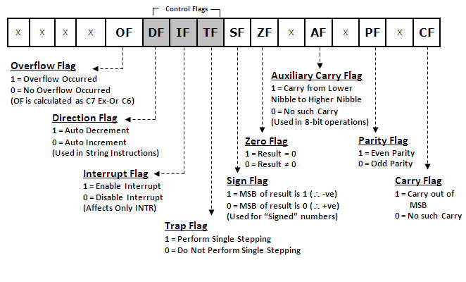

# Introduction

The addressing modes for this powerful family of microprocessors are described
for the real, protected, and flat modes of operation. Real mode memory (DOS
memory) exists at locations 00000H–FFFFFH, the first 1M byte of the memory
system, and is present on all versions of the microprocessor. Protected mode
memory (Windows memory) exists at any location in the entire protected memory
system, but is available only to the 80286–Core2, not to the earlier 8086 or
8088 microprocessors. Protected mode memory for the 80286 contains 16M bytes;
for the 80386–Pentium, 4G bytes; and for the Pentium Pro through the Core2,
either 4G or 64G bytes. With the 64-bit extensions enabled, the Pentium 4
and Core2 address 1T byte of memory in a flat memory model. Windows Vista
or Windows 64 is needed to operate the Pentium 4 or Core2 in 64-bit mode
using the flat mode memory to access the entire 1T byte of memory.

# 8086


- 8086 does not have a RAM or ROM inside it. However, it has internal registers for storing intermediate and final results and interfaces with memory located outside it through the System Bus.
- It is a 16-bit Integer processor in a 40 pin, Dual Inline Packaged IC.
- The size of the internal registers(present within the chip) indicate how much information the processor can operate on at a time (in this case 16-bit registers) and how it moves data around internally within the chip, sometimes also referred to as the internal data bus.
- 8086 provides the programmer with 14 internal registers, each 16 bits or 2 Bytes wide.

### Memory segmentation:

- To increase execution speed and fetching speed, 8086 segments the memory. 
- It’s 20 bit address bus can address 1MB of memory, it segments it into 16 64kB segments. 
- 8086 works only with four 64KB segments within the whole 1MB memory.

### The internal architecture is divided into 2 units

1. The Bus Interface Unit (BIU)
2. The Execution Unit (EU)

## 1. The Bus Interface Unit (BIU)

- It provides the interface of 8086 to external memory and I/O devices via the System Bus. It performs various machine cycles such as memory read, I/O read etc. to transfer data between memory and I/O devices. 

### Role of BIU

- It generates the 20 bit physical address for memory access.
- It fetches instructions from the memory.
- It transfers data to and from the memory and I/O.
- Maintains the 6 byte prefetch instruction queue(supports pipelining).
- BIU mainly contains the 4 Segment registers, the Instruction Pointer, a prefetch queue and an Address Generation Circuit

### Instruction Pointer (IP):

- It is a 16 bit register. It holds offset of the next instructions in the **Code Segment**
- IP is incremented after every instruction byte is fetched.
- IP gets a new value whenever a branch instruction occurs.
- CS is multiplied by 10H to give the 20 bit physical address of the Code Segment.
- Address of the next instruction is calculated as **CS x 10H + IP**.

Example: 

```
CS = 4321H 
IP = 1000H 
then CS x 10H = 43210H + offset =  44210H  
```

### Code Segment register

- CS holds the base address for the Code Segment. 
- All programs are stored in the Code Segment and accessed via the IP(instruction pointer register). 
- CS register cannot be modified by executing any instruction except branch instructions

### Data Segment register

DS holds the base address for the Data Segment. 

### Stack Segment register

SS holds the base address for the Stack Segment. 

### Extra Segment register

ES holds the base address for the Extra Segment. 

### Address Generation Circuit:

- The BIU has a Physical Address Generation Circuit.
- It generates the 20 bit physical address using Segment and Offset addresses using the formula: 

```
Physical Address = Segment Address x 10H + Offset Address
```

### 6 Byte Pre-fetch Queue

- It is a 6-byte FIFO RAM used to implement Pipelining.
- Fetching the next instruction (by BIU from CS) while executing the current instruction is called **pipelining**.
- BIU fetches the next "six instruction-bytes" from the Code Segment and stores it into the queue. Execution Unit (EU) removes instructions from the queue and executes them.
- The queue is refilled when atleast two bytes are empty as 8086 has a 16-bit data bus.
- Pipelining fails when a branch occurs, as the pre-fetched instructions are no longer useful. Hence as soon as 8086 detects a branch operation, it clears/discards the entire queue. Now, the next six bytes from the new location (branch address) are fetched and stored in the queue and Pipelining continues.

## 2. The Execution Unit (EU)

The main components of the EU are General purpose registers, the ALU, Special purpose registers, Instruction Register and Instruction Decoder and the Flag/Status Register. 

- Fetches instructions from the Queue in BIU, decodes and executes arithmetic and logic operations using the ALU.
- Sends control signals for internal data transfer operations within the microprocessor.
- Sends request signals to the BIU to access the external module.
- It operates with respect to clock cycles (T-states) and not machine cycles.
- 8086 has four 16 bit general purpose registers AX, BX, CX and DX. Store intermediate values during execution. Each of these have two 8 bit parts (higher and lower). 

#### AX register

It holds operands and results during multiplication and division operations. Also an accumulator during String operations. 

#### BX register

It holds the memory address (offset address) in indirect addressing modes. 

#### CX register

It holds count for instructions like loop, rotate, shift and string operations. 

#### DX register

It is used with AX to hold 32 bit values during multiplication and division. 

### Arithmetic Logic Unit (16 bit)

Performs 8 and 16 bit arithmetic and logic operations. 

### Special purpose registers (16-bit)

1. **Stack Pointer(SP)**
- Points to Stack top. 
- Stack is in Stack Segment, used during instructions like PUSH, POP, CALL, RET etc.
2. **Base Pointer(BP)**
- BP can hold offset address of any location in the stack segment. 
- It is used to access random locations of the stack.
3. **Source Index(SI)**
- It holds offset address in Data Segment during string operations.
4. **Destination Index(DI)**
- It holds offset address in Extra Segment during string operations.

### Instruction Register and Instruction Decoder

The EU fetches an opcode from the queue into the instruction register. The instruction decoder decodes it and sends the information to the control circuit for execution. 

### Flag/Status register (16 bits):

It has 9 flags that help change or recognize the state of the microprocessor. 

 

### 6 Status flags:

1. carry flag(CF)
   It is set whenever there is a carry {or borrow} out of the MSB of a the result (D7 bit for an 8-bit operation D15 bit for a 16-bit operation)

2. parity flag(PF)
   It is set if the result has even parity.

3. auxiliary carry flag(AF)
   It is set if a carry is generated out of the Lower Nibble.
   It is used only in 8-bit operations like DAA and DAS.

4. zero flag(Z)
   It is set if the result is zero.

5. sign flag(S)
   It is set if the MSB of the result is 1.
   For signed operations, such a number is treated as –ve.

6. overflow flag (O)
   It will be set if the result of a signed operation is too large to fit in the number of bits available to represent it. It can be checked using the instruction INTO (Interrupt on Overflow).

Status flags are updated after every arithmetic and logic operation. 

### 3 Control flags:

1. trap flag(TF)
   It is used to set the Trace Mode i.e. start Single Stepping Mode.
   Here the µP is interrupted after every instruction so that, the program can be debugged.

2. interrupt flag(IF)
   It is used to mask (disable) or unmask (enable) the INTR interrupt.

3. direction flag(DF)
   If this flag is set, SI and DI are in auto-decrementing mode in String Operations.

These flags can be set or reset using control instructions like CLC, STC, CLD, STD, CLI, STI, etc

The Control flags are used to control certain operations. 

## References

- https://lambdageeks.com/8086-microprocessors-pin-diagram/
- https://www.geeksforgeeks.org/architecture-of-8086/
