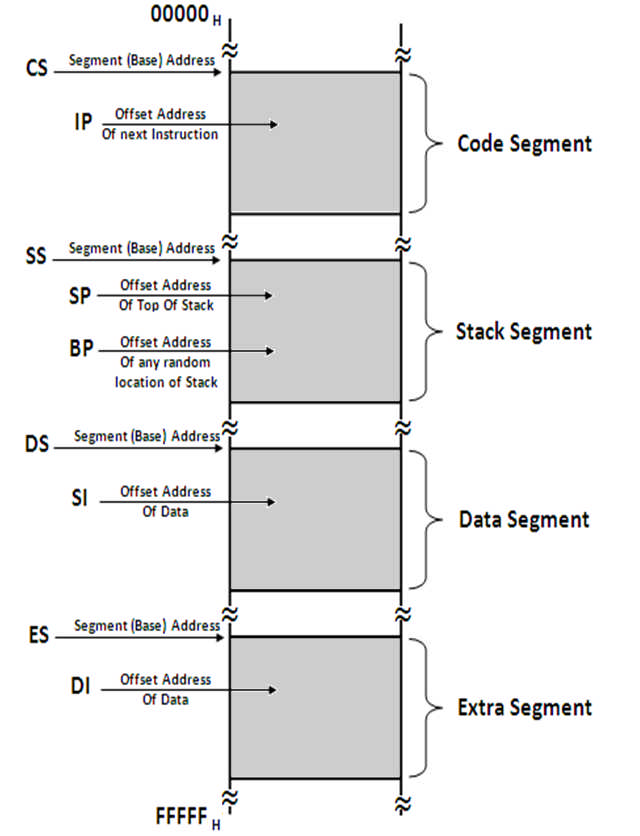

# Memory Segmentation in 8086

 

## Concept of Segmentation

- Segmentation means dividing the memory into logically different parts called segments.
- 8086 has a 20-bit address bus, hence it can access 2^20 Bytes i.e. 1MB memory.
- But this also means that Physical address will now be 20 bit. It is not possible to work with a 20 bit address as it is not a byte compatible number. (20 bits is two and a half bytes). To avoid working with this incompatible number, we create a **virtual model** of the memory.
- Here the memory is divided into 4 segments: Code, Stack Data and Extra.

- The max size of a segment is 64KB and the minimum size is 16 bytes.
- Now programmer can access each location with a VIRTUAL ADDRESS.
- The Virtual Address is a combination of Segment Address and Offset Address.
- Segment Address indicates where the segment is located in the memory (base address)
- Offset Address gives the offset of the target location within the segment.
- Since both, Segment Address and Offset Address are 16 bits each, they both are compatible numbers and can be easily used by the programmer.
- Moreover, Segment Address is given only in the beginning of the program, to initialize the segment. Thereafter, we only give offset address.
- Hence we can access 1 MB memory using only a 16 bit offset address for most part of the program. This is the advantage of segmentation.

- Moreover, dividing Code, stack and Data into different segments, makes the memory more organized and prevents accidental overwrites between them.
- The Maximum Size of a segment is 64KB because offset addresses are of 16 bits. 216 = 64KB.
- As max size of a segment is 64KB, programmer can create multiple Code/Stack/Data segments till the entire 1 MB is utilized, but only one of each type will be currently active.
- The physical address is calculated by the microprocessor, using the formula:
  ```
  PHYSICAL ADDRESS = SEGMENT ADDRESS X 10H + OFFSET ADDRESS
  Ex: if Segment Address = 1234H and Offset Address is 0005H then
  Physical Address = 1234H x 10H + 0005H = 12345H
  ```
- This formula automatically ensures that the minimum size of a segment is 10H bytes
(10H = 16 Bytes).

## Code Segment
- This segment is used to hold the **program** to be executed.
- **Instruction are fetched** from the Code Segment.
- CS register holds the 16-bit base address for this segment.
- IP register (Instruction Pointer) holds the 16-bit offset address.

## Data Segment
- This segment is used to hold **general data**.
- This segment also holds the **source operands** during **string operations**.
- DS register holds the 16-bit base address for this segment.
- BX register is used to hold the 16-bit offset for this segment.
- SI register (Source Index) holds the 16-bit offset address during String Operations.

## Stack Segment
- This segment holds the **Stack memory**, which operates in LIFO manner.
- SS holds its Base address.
- SP (Stack Pointer) holds the 16-bit offset address of the Top of the Stack.
- BP (Base Pointer) holds the 16-bit offset address during **Random Access**.

## Extra Segment
- This segment is used to hold **general data**.
- Additionally, this segment is used as the destination during String Operations.
- ES holds the Base Address.
- DI holds the offset address during string operations.
