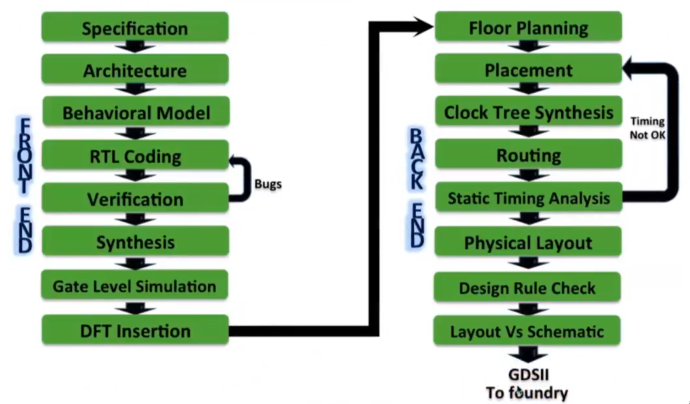

## ASIC Design Flow

## Verilog HDL

- Hardware Description Language
- IEEE standard 1364-2001 - describes syntax, not the style
- Synthesizable Constructs & Constructs for Simulation also.
  - Synthesis: converting rtl code into netlist
- Digital and Analog(only simulation) design language 

## Abstraction Level
- Circuit Level
  - CMOS Circuit

- Gate Level
  - Basic gates are available as "Primitives"

- Data Flow Level
  - Register Transfer Level
  - Realized through concurrent assignments

- Behavioural Level
  - Highest level of design description
  - Function only
  - Stimulus generation
  - No architecture
  - Design modelling

